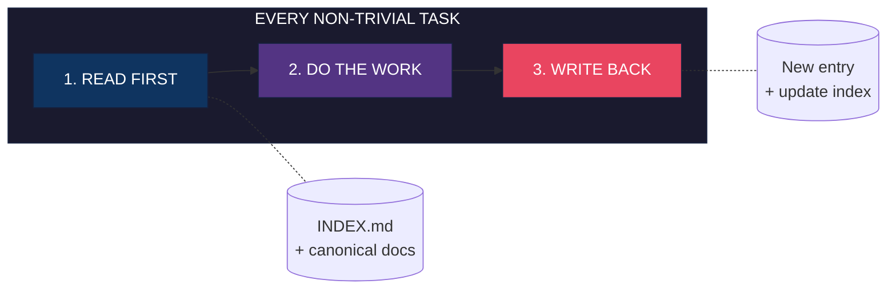

<!--
  Want a custom header image? Try: https://github.com/jgalea/retrohead
  Styles: Synthwave, VHS, Matrix, C64, ASCII terminal
-->

<div align="center">


[](CHANGELOG.md)
[](LICENSE)
[](https://claude.ai/claude-code)
[](https://github.com/features/copilot)

**Stop re-investigating bugs you already fixed. Stop re-exploring code you already understood.**

[Quick Start](#quick-start) | [How It Works](#how-it-works) | [Advanced Usage](#advanced-usage-the-context-workspace) | [CLI Tools](#cli-tools)

</div>

---

## The Problem

Without persistent memory, every AI session starts from zero:

```
┌─────────────────────────────────────────────────────────────────────────┐
│  MONDAY     "How does auth middleware work?"    →  20 min investigation │
│  TUESDAY    "How does auth middleware work?"    →  20 min (AGAIN)       │
│  WEDNESDAY   Same bug you fixed last week?      →  Debug from scratch   │
└─────────────────────────────────────────────────────────────────────────┘
                                    |
                                    v
              You're paying tokens to rediscover the same things
```

---

## The Solution

Knowledge Database creates structured memory that agents read *before* exploring:



**Result:** Investigations compound. Bugs stay fixed. Onboarding is instant.

---

## Before & After

<table>
<tr>
<th width="50%">Without KB</th>
<th width="50%">With KB</th>
</tr>
<tr>
<td>

```
Same question twice?
  → 20 min each time

Bug reintroduced?
  → Debug from scratch

New team member?
  → "Ask Sarah, she knows"

Context across sessions?
  → Lost forever
```

</td>
<td>

```
Same question twice?
  → 30 sec (read entry)

Bug reintroduced?
  → Entry shows exact fix

New team member?
  → Self-service docs

Context across sessions?
  → Permanent memory
```

</td>
</tr>
</table>

---

## Enforcement Mechanisms

Not opt-in — these **ten mechanisms** enforce on every non-trivial task:

```
┌────────────────────────────────────────────────────────────────────────────────┐
│                           THE TEN MECHANISMS                                   │
├────────────────────────────────────────────────────────────────────────────────┤
│                                                                                │
│  1. ALWAYS-ON        Mandatory every task, not triggered by phrases            │
│                                                                                │
│  2. ROUTING          INDEX.md points to canonical docs, not just entries       │
│                                                                                │
│  3. LOCK-STEP        Schema change? Doc MUST change too.                       │
│                                                                                │
│  4. HIERARCHY        Code > generated > docs (explicit ranking)                │
│                                                                                │
│  5. EVIDENCE         verified status REQUIRES proof block                      │
│                                                                                │
│  6. SCOPES           repo / session separation (write to right level)          │
│                                                                                │
│  7. MAINTENANCE      Dedup, tag reuse, fix wrong entries                       │
│                                                                                │
│  8. AUTO-CAPTURE     Non-trivial work = KB entry created (mandatory)           │
│                                                                                │
│  9. NO PROMPTS       Supersede autonomously with reason + replacement link     │
│                                                                                │
│ 10. INCREMENTAL      Record AS insights occur, not batched at session end      │
│                                                                                │
└────────────────────────────────────────────────────────────────────────────────┘
```

See [CLAUDE.md](CLAUDE.md) for full enforcement rules.

### What Triggers Auto-Capture?

| Task | Record? | Bucket |
|------|---------|--------|
| Debug failing test | YES | errors/ |
| Investigate "how does X work" | YES | explorations/ |
| Add feature (multi-file) | YES | solutions/ |
| Choose between approaches | YES | decisions/ |
| Rename with reasoning | YES | decisions/ |
| Fix obvious typo | NO | - |

**Rule**: If there was reasoning, record it. Future you will ask "why?"

### What's Most Valuable?

1. **Errors with fixes** - Prevents bug reintroduction
2. **Investigations** - Prevents re-exploration
3. **Decisions with rationale** - Prevents re-debating
4. **Multi-step solutions** - Prevents redoing work

### Session Resilience

Sessions end unexpectedly: context exhaustion, logout, crash. **Memory not committed = memory lost.**

```
BAD:  Work -> Work -> Work -> Session ends -> Lost everything
GOOD: Work -> Record -> Work -> Record -> Session ends -> Nothing lost
```

**Rule**: If session ended RIGHT NOW, would insights survive? If no, record them.

---

## Quick Start

### Install (pick one)

```bash
# Claude Plugin Marketplace
claude plugin marketplace add dcoferraz/knowledge-database

# Manual
git clone https://github.com/dcoferraz/knowledge-database.git
cp -r knowledge-database/knowledge-database ~/.claude/skills/

# Standalone (any agent)
git clone https://github.com/dcoferraz/knowledge-database.git
./scripts/init-knowledge-db.sh
```

Then wire enforcement (idempotent; merges into existing settings/hooks/CI):

```bash
knowledge-db/install.sh          # agent hard rules + Stop hook + git pre-commit + CI job
knowledge-db/install.sh --check  # audit: fails if any enforcement layer is missing
```

### What Gets Created

```
knowledge-db/
├── INDEX.md           GENERATED by bin/kb index — search here first
├── INDEX.html         GENERATED human-facing view — double-click, browse entries + proof
├── AGENT.md           Portable agent hard rules (read-first, empty-KB, never-prompt)
├── kb.config.json     Single source of truth: buckets, statuses, tags, budgets
├── bin/kb             Zero-dependency CLI: new / index / check (rules KB001-KB011)
├── install.sh         Idempotent enforcement installer
├── _TEMPLATE.md       Reference layout (prefer `bin/kb new`)
├── explorations/      "How does X work?"
├── solutions/         "How we built Y"
├── errors/            "Bug Z: symptom → root cause → fix → prevention"
└── decisions/         "Why we chose A over B"
```

---

## CLI Tools

```bash
# Enforcement CLI (zero dependencies, Python 3 stdlib)
knowledge-db/bin/kb new error yaml-injection   # scaffold a valid entry, regen INDEX
knowledge-db/bin/kb index                      # regenerate INDEX.md + INDEX.html from front-matter
knowledge-db/bin/kb check                      # validate: "RULE_ID file: message", non-zero exit
knowledge-db/bin/kb check --staged             # + lockstep (KB009) and write-back (KB011) rules

# Helpers (bash)
./scripts/init-knowledge-db.sh                 # initialize KB structure
./scripts/kb-ingest --input notes.txt --auto   # ingest text/transcripts into KB entries
./scripts/kb-discover ./legacy-app             # discover codebase boundaries
```

### Tool Overview

| Tool | Purpose | Example |
|------|---------|---------|
| `bin/kb` | Scaffold, index, validate (rules KB001-KB012) | `kb check --json` |
| `install.sh` | Wire agent hook + pre-commit + CI | `install.sh --check` |
| `kb-ingest` | Parse text into KB entry | `cat notes.txt \| kb-ingest --auto` |
| `kb-discover` | Scan codebase, generate exploration | `kb-discover ./legacy-app` |
| `kb-lint` | Legacy health check (superseded by `bin/kb check`) | `kb-lint --fix` |

Every rule has a stable ID and a conformance fixture (`tests/run-kb-tests.sh`).
The full rule table lives in [knowledge-db/README.md](knowledge-db/README.md).

---

## How It Works

### Step 1: Agent Checks KB First

Before exploring, agent searches `INDEX.md`:

```markdown
## Ready-Answer Table
| Topic      | Canonical Source                              |
|------------|-----------------------------------------------|
| Auth flow  | explorations/2026-08-15-auth-middleware.md    |
| DB schema  | docs/schema.md                                |

## Explorations
| Date       | Title                  | Status   | Entry |
|------------|------------------------|----------|-------|
| 2026-08-15 | Auth middleware chain  | verified | [...] |
```

**verified entry exists?** Use it, skip investigation.

### Step 2: New Findings Get Recorded

After non-trivial work, agent creates an entry:

```yaml
---
title: Auth middleware chain
type: exploration
status: verified          # Requires proof!
tags: [area:auth, layer:middleware]
sources:
  - src/middleware/auth.ts:42-89    # Ground EVERY claim
---

## Summary
Auth flows through 3 middleware: session, jwt, rbac.

## Verification                      # Required for "verified"
$ npm test -- --grep "auth"
PASS src/middleware/auth.test.ts
```

### Step 3: Errors Capture Prevention

`errors/` entries require **all four sections**:

```
┌─────────────────────────────────────────────────────────────────────┐
│  ERROR ENTRY STRUCTURE                                              │
├─────────────────────────────────────────────────────────────────────┤
│                                                                     │
│  ## Symptom                                                         │
│  TypeError: Cannot read property 'user' of undefined                │
│                                                                     │
│  ## Root Cause                                                      │
│  Session middleware skipped on /api/webhook (src/app.ts:23)         │
│                                                                     │
│  ## Fix                                                             │
│  Added session check in webhook handler (src/routes/webhook.ts:15)  │
│                                                                     │
│  ## Prevention                                                      │
│  All routes must validate session before accessing req.user         │
│                                                                     │
└─────────────────────────────────────────────────────────────────────┘
```

**This bug will never be reintroduced** — agent reads this before touching auth code.

---

## Status Rules

```
┌──────────────┬─────────────────────────┬─────────────────────────────────┐
│ Status       │ Meaning                 │ Requirements                    │
├──────────────┼─────────────────────────┼─────────────────────────────────┤
│ verified     │ Proven true             │ Verification block with PROOF   │
│ tentative    │ Best understanding      │ Any unsourced claim             │
│ superseded   │ Outdated                │ related: MUST link replacement  │
└──────────────┴─────────────────────────┴─────────────────────────────────┘
```

**No proof = no verified.** The Verification block must contain: command + output, test result, or screenshot.

---

## Four Buckets

```mermaid
flowchart TB
    subgraph KB["KNOWLEDGE DATABASE"]
        direction TB
        E["explorations/\n'How does X work?'"]
        S["solutions/\n'How we built Y'"]
        R["errors/\n'What broke + fix'"]
        D["decisions/\n'Why we chose A'"]
    end

    Q1["Understanding something"] --> E
    Q2["Building something"] --> S
    Q3["Something broke"] --> R
    Q4["Choosing between options"] --> D

    style KB fill:#1a1a2e,stroke:#16213e
    style E fill:#0f3460,stroke:#16213e,color:#fff
    style S fill:#533483,stroke:#16213e,color:#fff
    style R fill:#e94560,stroke:#16213e,color:#fff
    style D fill:#f39c12,stroke:#16213e,color:#fff
```



One entry per task. File under dominant intent, cross-link the rest.

---

## Repository Structure

```
knowledge-database/
├── README.md                  You are here
├── LICENSE
├── CLAUDE.md                  HARD RULE + enforcement mechanisms
├── .claude-plugin/
│   └── marketplace.json       Plugin marketplace metadata
├── knowledge-database/
│   └── SKILL.md               Skill definition
├── scripts/
│   ├── init-knowledge-db.sh   Initialize KB structure
│   ├── kb-ingest              Parse text into entries
│   ├── kb-discover            Scan codebase
│   └── kb-lint                Lint KB for issues
├── .kb-templates/
│   ├── README.md
│   ├── INDEX.md
│   └── _TEMPLATE.md
└── roadmap/                   Future evolution plans
```

---

## Compatibility

| Agent | Install Method |
|-------|----------------|
| Claude Code | Plugin marketplace or manual skill |
| GitHub Copilot | Copy CLAUDE.md to `.github/copilot-instructions.md` |
| Cursor | Copy CLAUDE.md to `.cursor/rules/` |
| Any other | Run `init-knowledge-db.sh` + add HARD RULE to agent config |

---

## Roadmap

See [roadmap/](roadmap/) for planned evolution:

```
Phase 1 ━━━━━━━━━━━●━━━━━━━━━━ Phase 2 ━━━━━━━━━━━○━━━━━━━━━━ Phase 3
     Local CLI Tools              Git Hooks              GitHub Action
     (current)                    (planned)              (future)

     - kb-ingest                  - post-commit          - Auto-entry on PR
     - kb-discover                - pre-push             - Shared team KB
     - kb-lint                    - suggest entries      - Cross-repo search
```

---

## Advanced Usage: The Context Workspace

Once you understand the basic KB pattern, there is a more powerful approach.

The Quick Start embeds `knowledge-db/` inside your repo. That works for getting started. But the **Context Workspace** pattern is vastly better:

```
my-project-workspace/           <-- Agent runs from HERE
|-- app/                        <-- Your actual codebase (git repo)
|-- knowledge-db/               <-- KB lives OUTSIDE the repo
|-- 01-specs/                   <-- PRDs, requirements, designs
|-- 02-meetings/                <-- Transcripts, decision records
|-- 03-references/              <-- Related code, examples
+-- 04-vendor-docs/             <-- API docs, SDK references
```

**Why this is better:**
- Agent sees code + specs + meetings + references (not just code)
- KB does not pollute your repo history
- Private docs (meeting notes, internal decisions) can live here
- Multiple repos can share one KB
- Decisions tracked with WHO made them and WHY

The tools (`kb-ingest`, `kb-discover`) work on specs, meeting transcripts, and vendor docs - not just code. Your agent becomes *project-aware*, not just *code-aware*.

**Read the full guide: [ADVANCED.md](ADVANCED.md)**

It covers:
- The numbered prefix convention (01-, 02-, 03-)
- Using KB tools on your full context
- Decision tracking with stakeholder attribution
- Why this matters for project managers and team leads
- Complete setup instructions

---

## FAQ

<details>
<summary><b>How is this different from just writing notes in CLAUDE.md?</b></summary>

Structured buckets + index + templates + enforcement = searchable, maintainable, scalable. Notes become a mess at 20+ entries.
</details>

<details>
<summary><b>Won't this slow down simple tasks?</b></summary>

The HARD RULE only applies to "non-trivial" tasks (multi-file investigation, debugging, decisions). One-liners skip it.
</details>

<details>
<summary><b>What if an entry becomes outdated?</b></summary>

Mark as `superseded`, link to replacement in `related:`. History preserved, readers directed to current truth.
</details>

<details>
<summary><b>What if I'm not sure if something is verified?</b></summary>

If in doubt, use `tentative`. Upgrade to `verified` only when you have actual proof in the Verification block.
</details>

---

## Contributing

PRs welcome. Key areas:
- More agent integrations
- Better templates for specific domains
- Tooling improvements (kb-ingest, kb-discover, kb-lint)
- Phase 2/3 implementation (hooks, GitHub Action)

---

## License

MIT

---

<div align="center">

**Built for agents that learn. By agents that learn.**

Star this repo if it saved you from re-investigating something.

</div>
