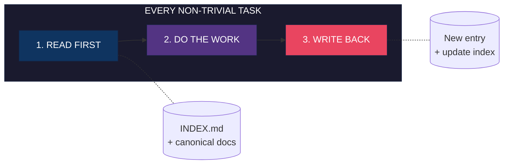

<!--
  Want a custom header image? Try: https://github.com/jgalea/retrohead
  Styles: Synthwave, VHS, Matrix, C64, ASCII terminal
-->

<div align="center">

```
╔══════════════════════════════════════════════════════════════════════════════════╗
║                                                                                  ║
║   ██╗  ██╗███╗   ██╗ ██████╗ ██╗    ██╗██╗     ███████╗██████╗  ██████╗ ███████╗ ║
║   ██║ ██╔╝████╗  ██║██╔═══██╗██║    ██║██║     ██╔════╝██╔══██╗██╔════╝ ██╔════╝ ║
║   █████╔╝ ██╔██╗ ██║██║   ██║██║ █╗ ██║██║     █████╗  ██║  ██║██║  ███╗█████╗   ║
║   ██╔═██╗ ██║╚██╗██║██║   ██║██║███╗██║██║     ██╔══╝  ██║  ██║██║   ██║██╔══╝   ║
║   ██║  ██╗██║ ╚████║╚██████╔╝╚███╔███╔╝███████╗███████╗██████╔╝╚██████╔╝███████╗ ║
║   ╚═╝  ╚═╝╚═╝  ╚═══╝ ╚═════╝  ╚══╝╚══╝ ╚══════╝╚══════╝╚═════╝  ╚═════╝ ╚══════╝ ║
║                                                                                  ║
║   ██████╗  █████╗ ████████╗ █████╗ ██████╗  █████╗ ███████╗███████╗              ║
║   ██╔══██╗██╔══██╗╚══██╔══╝██╔══██╗██╔══██╗██╔══██╗██╔════╝██╔════╝              ║
║   ██║  ██║███████║   ██║   ███████║██████╔╝███████║███████╗█████╗                ║
║   ██║  ██║██╔══██║   ██║   ██╔══██║██╔══██╗██╔══██║╚════██║██╔══╝                ║
║   ██████╔╝██║  ██║   ██║   ██║  ██║██████╔╝██║  ██║███████║███████╗              ║
║   ╚═════╝ ╚═╝  ╚═╝   ╚═╝   ╚═╝  ╚═╝╚═════╝ ╚═╝  ╚═╝╚══════╝╚══════╝              ║
║                                                                                  ║
║                      Durable Memory for AI Coding Agents                         ║
║                                                                                  ║
╚══════════════════════════════════════════════════════════════════════════════════╝
```

[](LICENSE)
[](https://claude.ai/claude-code)
[](https://github.com/features/copilot)

**Stop re-investigating bugs you already fixed. Stop re-exploring code you already understood.**

[Quick Start](#quick-start) | [How It Works](#how-it-works) | [Advanced Usage](#advanced-usage-the-context-workspace) | [CLI Tools](#cli-tools)

</div>

---

## The Problem

Without persistent memory, every AI session starts from zero:

```
┌─────────────────────────────────────────────────────────────────────────┐
│  MONDAY     "How does auth middleware work?"    →  20 min investigation │
│  TUESDAY    "How does auth middleware work?"    →  20 min (AGAIN)       │
│  WEDNESDAY   Same bug you fixed last week?      →  Debug from scratch   │
└─────────────────────────────────────────────────────────────────────────┘
                                    |
                                    v
              You're paying tokens to rediscover the same things
```

---

## The Solution

Knowledge Database creates structured memory that agents read *before* exploring:



**Result:** Investigations compound. Bugs stay fixed. Onboarding is instant.

---

## Before & After

<table>
<tr>
<th width="50%">Without KB</th>
<th width="50%">With KB</th>
</tr>
<tr>
<td>

```
Same question twice?
  → 20 min each time

Bug reintroduced?
  → Debug from scratch

New team member?
  → "Ask Sarah, she knows"

Context across sessions?
  → Lost forever
```

</td>
<td>

```
Same question twice?
  → 30 sec (read entry)

Bug reintroduced?
  → Entry shows exact fix

New team member?
  → Self-service docs

Context across sessions?
  → Permanent memory
```

</td>
</tr>
</table>

---

## Enforcement Mechanisms

Not opt-in — these **seven mechanisms** enforce on every non-trivial task:

```
┌────────────────────────────────────────────────────────────────────────────────┐
│                           THE SEVEN MECHANISMS                                 │
├────────────────────────────────────────────────────────────────────────────────┤
│                                                                                │
│  1. ALWAYS-ON        Mandatory every task, not triggered by phrases            │
│                                                                                │
│  2. ROUTING          INDEX.md points to canonical docs, not just entries       │
│                                                                                │
│  3. LOCK-STEP        Schema change? Doc MUST change too.                       │
│                                                                                │
│  4. HIERARCHY        Code > generated > docs (explicit ranking)                │
│                                                                                │
│  5. EVIDENCE         verified status REQUIRES proof block                      │
│                                                                                │
│  6. SCOPES           user / repo / session separation                          │
│                                                                                │
│  7. MAINTENANCE      Dedup, tag reuse, fix wrong entries                       │
│                                                                                │
└────────────────────────────────────────────────────────────────────────────────┘
```

See [CLAUDE.md](CLAUDE.md) for full enforcement rules.

---

## Quick Start

### Install (pick one)

```bash
# Claude Plugin Marketplace
claude plugin marketplace add dcoferraz/knowledge-database

# Manual
git clone https://github.com/dcoferraz/knowledge-database.git
cp -r knowledge-database/knowledge-database ~/.claude/skills/

# Standalone (any agent)
git clone https://github.com/dcoferraz/knowledge-database.git
./scripts/init-knowledge-db.sh
```

### What Gets Created

```
knowledge-db/
├── INDEX.md           Search here first (Ready-Answer Table + catalog)
├── _TEMPLATE.md       Copy to create new entries
├── explorations/      "How does X work?"
├── solutions/         "How we built Y"
├── errors/            "Bug Z: symptom → root cause → fix → prevention"
└── decisions/         "Why we chose A over B"
```

---

## CLI Tools

```bash
# Initialize KB structure
./scripts/init-knowledge-db.sh

# Ingest text/transcripts into KB entries
./scripts/kb-ingest --input notes.txt --auto
cat conversation.txt | ./scripts/kb-ingest --bucket errors

# Discover codebase boundaries
./scripts/kb-discover ./legacy-app
./scripts/kb-discover ./src --summary

# Lint KB for issues
./scripts/kb-lint
```

### Tool Overview

| Tool | Purpose | Example |
|------|---------|---------|
| `kb-ingest` | Parse text into KB entry | `cat notes.txt \| kb-ingest --auto` |
| `kb-discover` | Scan codebase, generate exploration | `kb-discover ./legacy-app` |
| `kb-lint` | Check KB health | `kb-lint --fix` |

---

## How It Works

### Step 1: Agent Checks KB First

Before exploring, agent searches `INDEX.md`:

```markdown
## Ready-Answer Table
| Topic      | Canonical Source                              |
|------------|-----------------------------------------------|
| Auth flow  | explorations/2026-08-15-auth-middleware.md    |
| DB schema  | docs/schema.md                                |

## Explorations
| Date       | Title                  | Status   | Entry |
|------------|------------------------|----------|-------|
| 2026-08-15 | Auth middleware chain  | verified | [...] |
```

**verified entry exists?** Use it, skip investigation.

### Step 2: New Findings Get Recorded

After non-trivial work, agent creates an entry:

```yaml
---
title: Auth middleware chain
type: exploration
status: verified          # Requires proof!
tags: [area:auth, layer:middleware]
sources:
  - src/middleware/auth.ts:42-89    # Ground EVERY claim
---

## Summary
Auth flows through 3 middleware: session, jwt, rbac.

## Verification                      # Required for "verified"
$ npm test -- --grep "auth"
PASS src/middleware/auth.test.ts
```

### Step 3: Errors Capture Prevention

`errors/` entries require **all four sections**:

```
┌─────────────────────────────────────────────────────────────────────┐
│  ERROR ENTRY STRUCTURE                                              │
├─────────────────────────────────────────────────────────────────────┤
│                                                                     │
│  ## Symptom                                                         │
│  TypeError: Cannot read property 'user' of undefined                │
│                                                                     │
│  ## Root Cause                                                      │
│  Session middleware skipped on /api/webhook (src/app.ts:23)         │
│                                                                     │
│  ## Fix                                                             │
│  Added session check in webhook handler (src/routes/webhook.ts:15)  │
│                                                                     │
│  ## Prevention                                                      │
│  All routes must validate session before accessing req.user         │
│                                                                     │
└─────────────────────────────────────────────────────────────────────┘
```

**This bug will never be reintroduced** — agent reads this before touching auth code.

---

## Status Rules

```
┌──────────────┬─────────────────────────┬─────────────────────────────────┐
│ Status       │ Meaning                 │ Requirements                    │
├──────────────┼─────────────────────────┼─────────────────────────────────┤
│ verified     │ Proven true             │ Verification block with PROOF   │
│ tentative    │ Best understanding      │ Any unsourced claim             │
│ superseded   │ Outdated                │ related: MUST link replacement  │
└──────────────┴─────────────────────────┴─────────────────────────────────┘
```

**No proof = no verified.** The Verification block must contain: command + output, test result, or screenshot.

---

## Four Buckets

```mermaid
flowchart TB
    subgraph KB["KNOWLEDGE DATABASE"]
        direction TB
        E["explorations/\n'How does X work?'"]
        S["solutions/\n'How we built Y'"]
        R["errors/\n'What broke + fix'"]
        D["decisions/\n'Why we chose A'"]
    end

    Q1["Understanding something"] --> E
    Q2["Building something"] --> S
    Q3["Something broke"] --> R
    Q4["Choosing between options"] --> D

    style KB fill:#1a1a2e,stroke:#16213e
    style E fill:#0f3460,stroke:#16213e,color:#fff
    style S fill:#533483,stroke:#16213e,color:#fff
    style R fill:#e94560,stroke:#16213e,color:#fff
    style D fill:#f39c12,stroke:#16213e,color:#fff
```



One entry per task. File under dominant intent, cross-link the rest.

---

## Repository Structure

```
knowledge-database/
├── README.md                  You are here
├── LICENSE
├── CLAUDE.md                  HARD RULE + enforcement mechanisms
├── .claude-plugin/
│   └── marketplace.json       Plugin marketplace metadata
├── knowledge-database/
│   └── SKILL.md               Skill definition
├── scripts/
│   ├── init-knowledge-db.sh   Initialize KB structure
│   ├── kb-ingest              Parse text into entries
│   ├── kb-discover            Scan codebase
│   └── kb-lint                Lint KB for issues
├── .kb-templates/
│   ├── README.md
│   ├── INDEX.md
│   └── _TEMPLATE.md
└── roadmap/                   Future evolution plans
```

---

## Compatibility

| Agent | Install Method |
|-------|----------------|
| Claude Code | Plugin marketplace or manual skill |
| GitHub Copilot | Copy CLAUDE.md to `.github/copilot-instructions.md` |
| Cursor | Copy CLAUDE.md to `.cursor/rules/` |
| Any other | Run `init-knowledge-db.sh` + add HARD RULE to agent config |

---

## Roadmap

See [roadmap/](roadmap/) for planned evolution:

```
Phase 1 ━━━━━━━━━━━●━━━━━━━━━━ Phase 2 ━━━━━━━━━━━○━━━━━━━━━━ Phase 3
     Local CLI Tools              Git Hooks              GitHub Action
     (current)                    (planned)              (future)

     - kb-ingest                  - post-commit          - Auto-entry on PR
     - kb-discover                - pre-push             - Shared team KB
     - kb-lint                    - suggest entries      - Cross-repo search
```

---

## Advanced Usage: The Context Workspace

Here is where things get interesting.

The Quick Start shows you how to add a `knowledge-db/` folder inside your project. That works. But if you stop there, you are missing the bigger picture.

**The real power comes when you stop thinking of KB as "a folder in my repo" and start thinking of it as "the central nervous system of my entire project context."**

### The Problem With Embedding KB in Your Repo

When you put `knowledge-db/` inside your app folder, you create limitations:

1. **You must .gitignore it** - Or pollute your repo history with KB changes
2. **You cannot include private context** - Meeting notes, internal docs, client communications
3. **Your agent only sees code** - It misses specs, designs, decisions made in meetings
4. **Multiple repos cannot share knowledge** - Frontend and backend learn the same lessons separately

These are not small problems. They are the difference between an AI that helps and an AI that *understands your project*.

### The Context Workspace Pattern

Instead of embedding KB in your repo, create a parent folder that contains *everything* your agent needs to know:

```
my-project-workspace/                 <-- Agent runs from HERE
│
├── app/                              <-- Your actual codebase (this is the git repo)
│   ├── src/
│   ├── package.json
│   └── .git/
│
├── knowledge-db/                     <-- KB lives OUTSIDE the repo
│   ├── INDEX.md
│   ├── explorations/
│   ├── solutions/
│   ├── errors/
│   └── decisions/
│
├── 01-specs/                         <-- PRDs, requirements, designs
│   ├── product-requirements.md
│   ├── technical-design.md
│   └── api-contract.yaml
│
├── 02-meetings/                      <-- Transcripts, decision records
│   ├── 2026-08-15-kickoff.md
│   ├── 2026-08-18-architecture-review.md
│   └── 2026-08-20-client-feedback.md
│
├── 03-references/                    <-- Related code, examples, prior art
│   ├── competitor-analysis/
│   ├── legacy-system-docs/
│   └── sdk-examples/
│
├── 04-vendor-docs/                   <-- API docs, SDK references
│   ├── stripe-api.md
│   ├── auth0-integration.md
│   └── aws-services.md
│
└── CLAUDE.md                         <-- Workspace-level instructions
```

Now your agent has access to *everything*. Not just code. Everything.

### Why This is Vastly Better

Let me be direct: **the embedded KB approach is a 10% solution. The context workspace is the 100% solution.**

Here is what changes:

```
┌─────────────────────────────────────────────────────────────────────────────────┐
│                        EMBEDDED KB vs CONTEXT WORKSPACE                         │
├─────────────────────────────────────────────────────────────────────────────────┤
│                                                                                 │
│  EMBEDDED KB                          CONTEXT WORKSPACE                         │
│  ───────────                          ─────────────────                         │
│  Agent sees: code                     Agent sees: code + specs + meetings +     │
│                                                   references + decisions        │
│                                                                                 │
│  KB pollutes repo history             KB is separate, clean repo stays clean    │
│                                                                                 │
│  Private docs excluded                Private docs welcome                      │
│                                                                                 │
│  One repo = one KB                    Multiple repos share one KB               │
│                                                                                 │
│  Agent asks "how does this work?"     Agent asks "does this match the spec?"    │
│                                                                                 │
│  Decisions reconstructed from code    Decisions traced to meeting + person      │
│                                                                                 │
└─────────────────────────────────────────────────────────────────────────────────┘
```

### The Numbered Prefix Convention

Notice the folder names: `01-specs/`, `02-meetings/`, `03-references/`.

This is intentional:

1. **Predictable sort order** - Folders always appear in priority order
2. **Scan order for agents** - Agent can process highest-priority context first
3. **Self-documenting structure** - Anyone can understand the hierarchy at a glance

Use whatever numbering makes sense for your project. The point is: impose order.

### Using KB Tools on Your Full Context

Here is where it gets powerful. The CLI tools work on *any* folder, not just code:

```bash
# Discover boundaries from specs (not just code)
kb-discover ./01-specs/ --output knowledge-db/explorations/

# Ingest a meeting transcript into a decision entry
cat 02-meetings/2026-08-15-kickoff.md | kb-ingest --bucket decisions

# Generate exploration from vendor documentation
kb-discover ./04-vendor-docs/stripe-api.md --output knowledge-db/explorations/

# Lint the entire workspace KB
kb-lint ./knowledge-db/
```

Think about what this means:

- **Meeting transcript** becomes a decision entry with WHO made the decision and WHY
- **Spec document** becomes boundaries the agent checks against when implementing
- **Vendor docs** become explorations the agent reads before integrating

Your agent is not just coding anymore. Your agent is *project-aware*.

### Decision Tracking: Who and Why

The `decisions/` bucket becomes dramatically more valuable in a context workspace. Now you can capture:

```yaml
---
title: Use Stripe over PayPal for payments
type: decision
status: verified
date: 2026-08-15
tags: [area:payments, stakeholder:product]
sources:
  - 02-meetings/2026-08-15-kickoff.md:42-58
  - 01-specs/product-requirements.md:120-135
decision_by: Sarah Chen (Product Lead)
participants: [John (Eng), Maria (Finance), Alex (CTO)]
---

## Context

Needed to choose payment processor for v2 launch.

## Options Considered

1. **Stripe** - Better API, higher fees (2.9%)
2. **PayPal** - Brand recognition, clunky integration
3. **Square** - Good for in-person, weak online

## Decision

Stripe. Developer velocity more valuable than 0.5% fee difference at our scale.

## Consequences

- Must handle Stripe webhooks (see solutions/2026-08-16-stripe-webhooks.md)
- Finance needs Stripe dashboard access
- Revisit at 10k transactions/month

## Verification

Decision recorded in kickoff meeting (02-meetings/2026-08-15-kickoff.md:55).
Approved by Alex (CTO) same day.
```

Now when someone asks "why are we using Stripe?", the agent does not guess. The agent cites Sarah Chen, the kickoff meeting, and the exact reasoning.

**This is project management, not just code memory.**

### For Project Managers and Team Leads

If you are a PM or lead reading this, understand what the context workspace enables:

1. **Decision traceability** - Every architectural choice traced to a person, meeting, and rationale
2. **Spec compliance** - Agent checks implementations against actual requirements
3. **Onboarding acceleration** - New team members (human or AI) get full context instantly
4. **Institutional memory** - When people leave, their decisions stay documented
5. **Audit trail** - For regulated industries, you have a knowledge trail

You are not just helping developers code faster. You are building a **project brain** that persists across people, sessions, and time.

### Setting Up a Context Workspace

```bash
# Create the workspace structure
mkdir my-project-workspace
cd my-project-workspace

# Clone your actual repo into app/
git clone git@github.com:yourorg/yourapp.git app

# Initialize KB at workspace level
./path/to/scripts/init-knowledge-db.sh knowledge-db

# Create context folders
mkdir 01-specs 02-meetings 03-references 04-vendor-docs

# Create workspace-level CLAUDE.md
cat > CLAUDE.md << 'EOF'
# Project Workspace

## Structure
- app/           - The codebase (git repo)
- knowledge-db/  - Project memory (KB)
- 01-specs/      - Requirements and designs (read-only reference)
- 02-meetings/   - Meeting notes and transcripts
- 03-references/ - Related code and prior art
- 04-vendor-docs/- External API documentation

## Rules
- Always run agent from this workspace root
- Check knowledge-db/ before exploring
- Validate implementations against 01-specs/
- Record decisions with WHO and WHY
- Meeting transcripts are source of truth for verbal decisions
EOF

# Now always run your agent from my-project-workspace/
cd my-project-workspace
claude  # or cursor, copilot, etc.
```

### The Mindset Shift

Stop thinking: "I have a repo with a knowledge folder."

Start thinking: "I have a project workspace where code is just one component of the full context my agent needs to do its job well."

The agent that only sees code is working with one hand tied behind its back. The agent that sees code + specs + meetings + references + decisions is operating at full capacity.

That is the difference between AI assistance and AI partnership.

---

## FAQ

<details>
<summary><b>How is this different from just writing notes in CLAUDE.md?</b></summary>

Structured buckets + index + templates + enforcement = searchable, maintainable, scalable. Notes become a mess at 20+ entries.
</details>

<details>
<summary><b>Won't this slow down simple tasks?</b></summary>

The HARD RULE only applies to "non-trivial" tasks (multi-file investigation, debugging, decisions). One-liners skip it.
</details>

<details>
<summary><b>What if an entry becomes outdated?</b></summary>

Mark as `superseded`, link to replacement in `related:`. History preserved, readers directed to current truth.
</details>

<details>
<summary><b>What if I'm not sure if something is verified?</b></summary>

If in doubt, use `tentative`. Upgrade to `verified` only when you have actual proof in the Verification block.
</details>

---

## Contributing

PRs welcome. Key areas:
- More agent integrations
- Better templates for specific domains
- Tooling improvements (kb-ingest, kb-discover, kb-lint)
- Phase 2/3 implementation (hooks, GitHub Action)

---

## License

MIT

---

<div align="center">

**Built for agents that learn. By agents that learn.**

Star this repo if it saved you from re-investigating something.

</div>
